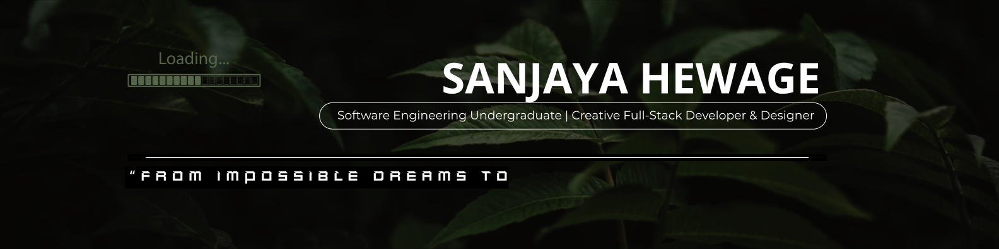

<!-- Header Banner -->

## **About Me**

I'm a passionate and ambitious Software Engineering undergraduate at ICBT, Sri Lanka, currently pursuing my BSc (Hons) in Software Engineering (Cardiff Metropolitan University - UK) after completing my Higher Diploma with Distinction.
I specialize in full-stack development, creative UI/UX design, and building meaningful digital solutions. I enjoy bringing ideas to life through clean code and thoughtful design blending logic with creativity.
I'm a purpose-driven learner, strong communicator, and dependable team player who thrives in both independent and collaborative environments. I love taking on challenges that push me to grow as both a developer and a creator.

---

##  **Skills & Technologies**

  <!-- Frontend -->
  

    
  

  <!-- Backend & Languages -->
  

    
  

  <!-- Databases -->
  

    
    
  

  <!-- AI/ML & Cloud / DevOps -->
  

    
    
  

  <!-- Tools & IDEs -->
  

    
  

 

---

<table>
<tr>
<td width="50%">

</td>
<td width="50%">

</td>
</tr>
</table>

---

## **Connect With Me**

### **💡 "Code, Create & Inspire"**

*Building the future, one line of code at a time* ✨

---

© 2025 Sanjaya Hewage (SP) | SP Solutions & Holdings

<!-- Footer Wave -->

